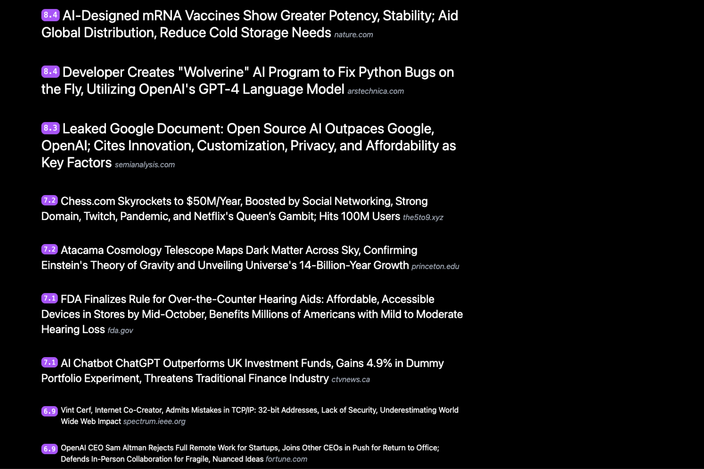

# News Score
> score the news, sort the news, rewrite the headlines



[News Score](https://newsscore.com) is an experiment in using open-source AI to score the news, sort the news and rewrite the headlines—so you can just catch up on the days headlines without the usual onslaught of modern media.

Everybody knows the problems with modern news—clickbait, sensationalism and bias.

News Score attempts to solve these problems with a unique algorithm:

* Find the latest and greatest news from many sources
* Use AI to score the news based on headlines and content
* Use AI to rewrite the best news into headlines that are unbiased, fact-based and informative
* Open-source everything to increase trust and reduce bias

News Score isn't perfect, but aims to be better than everything else. Because it's open-source, it can get better and better and better. You can even customize it to create your own news feed.

Try News Score for free at [newsscore.com](https://newsscore.com) or setup your own copy by cloning this repo.


## Setup

```bash
git clone https://github.com/themaximal1st/newsscore.git
cd newsscore
npm install
cp .env.template .env # edit .env
npm run dev
open http://localhost:3000
```


## Author

-   [The Maximalist](https://themaximalist.com/)
-   [@themaximal1st](https://twitter.com/themaximal1st)


## License

MIT
